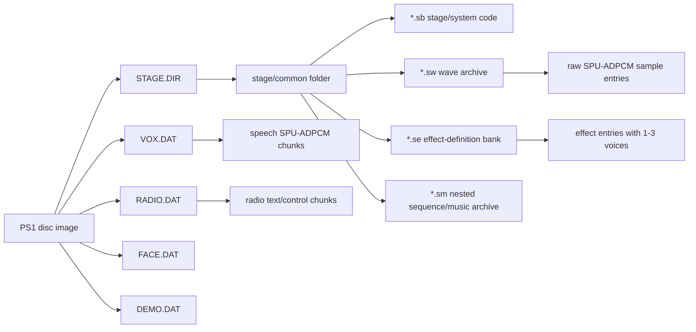

# Metal Gear Solid PSX Sound Effect Locations on Disc

## Executive summary

For the original **PlayStation** release of *Metal Gear Solid*, the famous **alert `!`**, **codec beeps**, **menu confirm/error**, **item pickup**, **caution/evasion**, and similar non-voice effects are **not stored as standalone WAV files** and are **not primarily in `VOX.DAT` or `RADIO.DAT`**. The strongest public evidence points instead to **`STAGE.DIR`** as the main SFX container, with sound effects represented by a combination of **`*.sw` wave archives** containing raw **SPU-ADPCM** sample data, **`*.se` effect-definition banks** that appear to describe 1–3 “voices” per effect entry, and probably **`*.sm` sequence/music archives** for longer sequence-driven playback. By contrast, **`VOX.DAT`** is the easy-to-extract speech/voice side, and **`RADIO.DAT`** is primarily radio/text/control data rather than the familiar codec chirps themselves. citeturn14view0turn92view0turn76view0turn77view0

The key negative finding is just as important: in the public primary docs and community reverse-engineering material I reviewed, I did **not** find a published, authoritative spreadsheet saying “`alert = bank X, sample Y`” for retail PSX. What *is* public is the archive structure, the analogies to Sony’s stock **VH/VB** and **SEQ/SEP** formats, extractor tooling for `STAGE.DIR`, and an **Integral debug “sound test” overlay** that strongly suggests the game internally enumerates sound IDs even if the retail disc does not expose a neat user-facing map. So the rigorous answer is: the sound effects live in **`STAGE.DIR` common/stage banks (`*.sw` + `*.se`)**, but the exact public bank/sample IDs for the famous UI blips remain **unpublished in the reviewed sources**. citeturn92view0turn81view0turn1view1turn1view4turn63view0turn0search14

## Scope and versions considered

You asked for multiple versions, but also said that if unspecified the default should be **PSX retail, unspecified region**. That is the baseline used here. The main primary format document I found describes **“Retail/PAL”** and demo builds; the main modern reverse-engineering repo targets **Integral** executables and overlays; and the **Windows PC port** is useful mostly as a contrast case because community discussion points to a different on-disk/install-directory layout that is much easier to browse for voice assets. I did **not** find a reliable public source in this review that distinguishes **US vs EU vs JP retail** at the level of individual SFX bank/sample IDs, so I treat “retail PSX” as one structural family and call out Integral/PC differences explicitly where they matter. citeturn14view0turn81view0turn84view0

| Version | Status in this report | What the reviewed sources actually provide |
|---|---|---|
| PSX retail unspecified region | **Primary target** | `STAGE.DIR`, `VOX.DAT`, `RADIO.DAT`, inner `*.sw/*.se/*.sm` structures, and retail/PAL top-level archive sizes/layout. citeturn14view0turn92view0 |
| PSX retail PAL | **Directly documented** | Problemkaputt/Korth gives a “Retail/PAL” top-level file summary and the generic `STAGE.DIR` format used by retail builds. citeturn14view0 |
| PSX Integral | **Secondary but very useful** | FoxdieTeam’s reverse-engineering repo documents Integral executables, dynamic overlay loading, and a `sound` debug overlay/sound-test entry. citeturn81view0 |
| PC port | **Contrast only** | Community advice references a PC install-directory `VOX` folder and use of PSound there; useful for voices, but not a clean provenance map back to PSX `*.sw/*.se` sample IDs. citeturn84view0 |

## Disc-level audio architecture

At the top level, the public retail layout shows **`STAGE.DIR`** as the main archive, **`VOX.DAT`** as a large speech/voice archive, **`RADIO.DAT`** as radio-related chunked data containing text/control data, **`DEMO.DAT`** as another large chunked archive, **`FACE.DAT`** for face animation assets, and **`ZMOVIE.STR`** for movie streams. In the same summary, Korth documents retail/PAL sizes such as **`STAGE.DIR = 0x42AE000`**, **`VOX.DAT = 0xB054800`**, **`RADIO.DAT = 0x1AA956`**, **`FACE.DAT = 0x358800`**, and **`ZMOVIE.STR = 0x2D4E800`**. That file-level split already explains why you were able to get the voices while failing to find the UI effects: the voices have a dedicated top-level archive, while the effect system is buried in `STAGE.DIR`’s per-folder asset banks. citeturn14view0

Korth further notes that **`VOX.DAT`** contains **SPU-ADPCM chunks** with a small header and up to `0x2000` bytes of ADPCM data, and that demo builds shipped with leaked **`.SYM`** name/offset lists for some `VOX.DAT` and `DEMO.DAT` blocks. **Retail discs do not have those leaked `.SYM` helpers**, which is one more reason voice extraction has historically been easier in demos and harder in final retail for anything beyond brute-force scanning. **`RADIO.DAT`**, meanwhile, is documented as chunked data containing “binary stuff, and text strings,” which is consistent with radio content management but not with the familiar standalone chirp assets many people expect. citeturn14view0

Inside **`STAGE.DIR`**, files sit in per-folder structures, and the important audio-related trailing file kinds are **`.sw` = wave archive**, **`.se` = sound effects**, and **`.sm` = sound music / nested archive**. Korth’s notes also preserve the community nicknames **`wvx`** for `.sw`, **`efx`** for `.se`, and **`mt3`** for `.sm`, which can be useful because some MGS webpages and tools still refer to those nicknames instead of the raw disc extensions. Files in these stage folders start on **`0x800`-byte boundaries**, and many folder/file IDs are represented as 16-bit checksums rather than plain names. citeturn14view0turn92view0



That archive relationship is the core practical map: **voices** are top-level and obvious; **famous alert/UI sounds** are **stage/common-bank assets inside `STAGE.DIR`** and have to be located by **folder → `.sw` bank → `.se` effect entry** rather than by browsing a speech archive. citeturn14view0turn92view0

## Sound bank anatomy

The most important technical point for extraction and modding is that MGS retail PSX does **not** expose classic named **`.VH/.VB`** banks at disc level. Instead, MGS appears to use custom containers that are *functionally analogous* to Sony’s stock audio formats. Sony’s own **`.VH`** header and **`.VB`** sample-data split stores program/tone metadata in the header and raw **SPU-ADPCM** samples in the binary side; likewise, Sony **`.SEQ/.SEP`** files store MIDI-like sequence/event data that drive sample banks. In MGS, **`.sw`** behaves like the *sample pool*, **`.se`** behaves like an *effect-definition / mini-sequence* layer, and **`.sm`** behaves like a *larger sequence archive* layer. That is the cleanest technical analogy the reviewed sources support. citeturn76view0turn77view0turn92view0

Korth’s `*.sw` format description is unusually useful for modding. A `.sw` file begins with a big-endian field that is usually **`0x800` or `0xC00`**, followed by a big-endian **file-list size (`N * 0x10`)**, then the file list itself. Each list entry is **`0x10` bytes**. The first 32-bit word is **little-endian** and stores **offset+flags**; **bits `0–16`** are the sample’s offset relative to the beginning of the **SPU-ADPCM data area**, while bits `17` and `18` are unknown flags. After the list comes another 16-byte header including a big-endian **SPU-ADPCM data-area size**, then the raw data itself. In other words, the stable “sample ID” inside a `.sw` bank is simply the **entry index** in that file list. citeturn92view0

The companion `*.se` format is also key. Korth documents a fixed **`0x80 * 0x10`** list at the start of the file, which means there are up to **128 effect entries** per `.se` bank. Each entry has four small header bytes, including a very plausible **voice-count** byte (`1..3`) and then **three 32-bit offsets** that point into a data region beginning at **`0x800`**. Unused entries are zero/`0xFFFFFFFF`. That gives you a very practical modding model: the thing you actually want to map for “alert” or “codec open” is probably **not just a `.sw` sample index**, but a **`.se` entry index** that in turn references one or more internal voice descriptors which then consume one or more `.sw` samples. That structure is much closer to an **effect bank** than to a folder of isolated one-shot WAVs. citeturn92view0

The companion `*.sm` files are less well understood in public docs, but the best current published description says they resemble **nested DOT1/DOTLESS archives** and are probably related to **sound music / MIDI-like** playback. Combined with Sony’s documented **SEQ/SEP** model, the strong working hypothesis is that MGS’s audio stack is a **custom sequence-driven system** rather than a simple direct-trigger sample library. That helps explain why the famous UI sounds have been harder for the community to index cleanly than codec speech or top-level voice archives. citeturn92view0turn77view0

For checksum-based identification, Korth gives the 16-bit **file-ID formula** used in `STAGE.DIR`, and even provides examples such as **`abst = 0x1706`** and **`selectvr = 0x8167`**. Applying the same formula to common menu/system names gives the following useful lookup set for hunting UI/common banks: **`sound = 0x698D`**, **`title = 0x655B`**, **`option = 0x978A`**, **`opening = 0x58CC`**, **`preope = 0x31BA`**, **`brf = 0x96A7`**, **`select = 0x8D5C`**, **`demosel = 0x2A2F`**, **`rank = 0x9265`**, **`roll = 0xCA26`**, and likely common-init candidates **`init = 0x45CA`**, **`inita = 0xB9A9`**, **`initb = 0xB9AA`**, **`initc = 0xB9AB`**. These latter values are calculations done by applying Korth’s published checksum formula to those names, which is useful when an extractor preserves IDs more reliably than strings. citeturn92view0

## Practical mapping of alert and UI sounds

After reviewing the primary format pages, public extractor readmes, the Integral reverse-engineering README, and public soundboard/SFX-pack material, the best-supported conclusion is that **there is no publicly published, canonical retail-PSX bank/sample table for the specific sounds you named**. The reviewed material gets you to the archive and bank layer very well, but it stops short of a definitive “`alert = folder X / bank Y / sample Z`” index. Public listening-oriented resources exist, but they do not preserve disc provenance cleanly enough to count as source-accurate mappings. citeturn92view0turn81view0turn1view1turn63view0turn0search14

What *is* mappable with high confidence is the **container class** and the **most likely search zone** for each sound class. The strongest heuristic is this: if it is **speech**, look in `VOX.DAT`; if it is a **famous UI/gameplay one-shot**, look in **`STAGE.DIR` `.sw/.se` banks**, starting with **common/system/menu folders** and then any always-loaded gameplay-common banks. Integral’s **`sound` debug “Sound Test” overlay** makes that inference even stronger, because it strongly implies that the engine keeps a runtime sound-ID space that can be enumerated if you can enable the debug functionality. citeturn14view0turn81view0

| Sound effect | Best-known on-disc location | Bank / ID status from reviewed sources | Practical hunt order |
|---|---|---|---|
| **Alert `!`** | **`STAGE.DIR` common/gameplay SFX bank (`*.sw` + matching `*.se`)**, not `VOX.DAT` or `RADIO.DAT`; this is an inference from the documented archive roles. citeturn14view0turn92view0 | **Exact retail PSX bank/sample ID not found publicly** in the reviewed material. Think in terms of **`.se` effect entry → `.sw` sample entry**, not standalone WAV. citeturn92view0turn81view0 | Start with **common/system folders** (`init*`, then `sound`, then menu/common overlays), then verify in-game via Integral sound test if available. citeturn92view0turn81view0 |
| **Caution / evasion beeps** | Same class as Alert: very likely **`STAGE.DIR` `.sw/.se` common bank** rather than speech archives. citeturn14view0turn92view0 | **No public exact bank/sample index found**. citeturn92view0turn81view0 | Same workflow as Alert, but compare neighboring `.se` entries because alert-state sounds are likely clustered or nearby in internal ID space. This is an inference from the effect-bank structure. citeturn92view0 |
| **Codec open/close chirps and dialing beeps** | **Not the codec speech itself**. Speech lives in `VOX.DAT`; the beeps are much more likely in **common/menu/radio-adjacent `STAGE.DIR` banks**. citeturn14view0 | **Exact bank/sample ID not found publicly**. Likely an effect-bank entry in a common/system `.se` plus one or more `.sw` one-shots. citeturn92view0 | Prioritize **`sound` (`0x698D`)**, **`abst` (`0x1706`)**, **`option` (`0x978A`)**, **`title` (`0x655B`)**, and common init folders. These IDs are calculated from Korth’s checksum formula. citeturn92view0 |
| **Menu move / confirm / error** | Very likely in **menu/common `STAGE.DIR` banks** associated with front-end overlays such as `abst`, `option`, `title`, `select`, `rank`, or other system folders. The overlay names themselves are documented in Integral. citeturn81view0turn92view0 | **Exact retail PSX bank/sample IDs not found publicly**. citeturn81view0turn92view0 | Inspect menu/common folders first; these are the most efficient candidate banks for the short UI blips. citeturn81view0turn92view0 |
| **Item pickup / equip / inventory UI** | Likely **`STAGE.DIR` common gameplay bank (`*.sw` + `.se`)** rather than `VOX.DAT`. citeturn14view0turn92view0 | **No exact public bank/sample index found**. citeturn92view0 | Start with common/init banks, then compare earliest gameplay/common stage folders if not found there. This is an inference from the per-folder playback model. citeturn92view0turn81view0 |
| **Voices / guard lines / codec speech** | **`VOX.DAT`**; demo builds additionally expose names/offsets via `VOX.SYM`, which is why voice extraction is comparatively straightforward. citeturn14view0 | Publicly mappable at block level much more easily than UI SFX. citeturn14view0 | Use `VOX.DAT`/`VOX.SYM` workflows or the PC port’s `VOX` folder; PSound is a common community choice. citeturn84view0 |

The best technical way to think about a “final exact map” is therefore:

**effect name** → **`STAGE.DIR` folder** → **specific `.se` effect entry index** → **one or more voice descriptors** → **one or more `.sw` sample-entry indices** → **relative ADPCM offsets inside the `.sw` data region**. That is the stable modding address space. Absolute byte offsets in a BIN/CUE are useful for auditing, but **folder name / `.se` entry / `.sw` sample index** is the more portable identifier across rebuilds and extractor outputs. citeturn92view0

## Extraction workflows for modding

The clean workflow is: **unpack disc → extract `STAGE.DIR` → shortlist common/system folders → inspect `*.sw` and `*.se` structurally → audition candidate samples in PSound or another raw-ADPCM-capable tool → if possible, verify/label IDs via Integral’s debug sound test**. That workflow follows directly from the on-disc structures Korth documents, the `Rex` extractor workflow, and the existence of Integral’s `sound` overlay in the reverse-engineering repo. citeturn92view0turn1view1turn81view0

### Unpack the disc image

FoxdieTeam’s README shows a documented **`mkpsxiso` / `dumpsxiso`** workflow for unpacking Integral BIN/CUE dumps into a regular folder tree; the syntax can be used the same way for a retail dump, adjusting filenames and paths to your image. Their README example is Windows-oriented, but the same binaries are often run under Wine on Linux/macOS. citeturn82view0turn82view1turn82view2

```bash
# Windows
dumpsxiso.exe MGS.bin -x MGS_DISC -s mgs.xml
Rex.exe MGS_DISC/MGS/STAGE.DIR stage_dir_out
```

```bash
# Linux/macOS via Wine
wine dumpsxiso.exe MGS.bin -x MGS_DISC -s mgs.xml
wine Rex.exe MGS_DISC/MGS/STAGE.DIR stage_dir_out
```

Jayveer’s **Rex** extractor explicitly documents `Rex.exe "path\to\stage.dir"` and optional output-directory usage for extracting `STAGE.DIR` and related archives. An older historical repo, **MGSDIRTool**, is also explicitly described as something that “Extracts files from STAGE.DIR,” which is useful corroboration that `STAGE.DIR` extraction is the right first move. citeturn1view1turn0search8

### Shortlist the first banks to inspect

Because the exact public per-sound bank/sample table is missing, you want to start with **high-value common folders** rather than every gameplay stage. The most promising documented common/system names from the Integral overlay list are **`abst`** (Save/Load Menu), **`option`** (Options Menu), **`title`**, **`opening`**, **`preope`**, **`rank`**, **`roll`**, **`select`**, and especially **`sound`** (the **Debug Menu Sound Test** overlay). Combined with Korth’s note that `init*` folders exist as special common folders inside `STAGE.DIR`, these are the first places I would look for codec/menu/UI blips before brute-forcing every gameplay folder on the disc. That folder priority is an inference, but it is a strong one grounded in the published structure and documented overlay names. citeturn81view0turn92view0

A practical checksum cheat-sheet for that first pass is:

- `abst = 0x1706`
- `sound = 0x698D`
- `title = 0x655B`
- `option = 0x978A`
- `opening = 0x58CC`
- `preope = 0x31BA`
- `brf = 0x96A7`
- `select = 0x8D5C`
- `demosel = 0x2A2F`
- `rank = 0x9265`
- `roll = 0xCA26`
- `init = 0x45CA`
- `inita = 0xB9A9`
- `initb = 0xB9AA`
- `initc = 0xB9AB`

Those IDs come from applying Korth’s published checksum formula to the corresponding names. citeturn92view0

### Inspect and dump `*.sw` / `*.se` deterministically

The following self-contained script implements the **published `*.sw` and `*.se` structures** closely enough to produce the two things you actually need for mapping: a **numbered list of `.sw` ADPCM samples** and a **numbered list of active `.se` effect entries** with their internal offsets. It does **not** decode to WAV; it dumps raw sample chunks and gives you reproducible entry indices and offsets so you can audition them in PSound or another decoder. The script logic is based on Korth’s `*.sw` and `*.se` field layouts, especially the `*.sw` file-list offsets and the `*.se` 128-entry list with `0x800`-based data offsets. citeturn92view0

```python
#!/usr/bin/env python3
# /// script
# requires-python = ">=3.12"
# ///

from __future__ import annotations

import argparse
import csv
import struct
from pathlib import Path


def be32(data: bytes, off: int) -> int:
    return struct.unpack_from(">I", data, off)[0]


def le32(data: bytes, off: int) -> int:
    return struct.unpack_from("<I", data, off)[0]


def parse_sw(path: Path, dump_dir: Path | None) -> None:
    data = path.read_bytes()

    if len(data) < 0x20:
        raise ValueError(f"{path}: too small to be a valid .sw")

    header2_off = be32(data, 0x00)  # usually 0x800 or 0xC00 per Korth
    file_list_size = be32(data, 0x04)
    entry_count = file_list_size // 0x10

    if file_list_size % 0x10 != 0:
        raise ValueError(f"{path}: file list size {file_list_size:#x} is not a multiple of 0x10")

    if header2_off + 0x10 > len(data):
        raise ValueError(f"{path}: header2 offset {header2_off:#x} is outside file")

    data_area_size = be32(data, header2_off + 0x04)
    data_area_start = header2_off + 0x10
    data_area_end = data_area_start + data_area_size

    if data_area_end > len(data):
        raise ValueError(
            f"{path}: data area end {data_area_end:#x} exceeds file length {len(data):#x}"
        )

    entries: list[dict[str, int]] = []
    for i in range(entry_count):
        base = 0x10 + i * 0x10
        off_flags = le32(data, base + 0x00)
        rel_off = off_flags & 0x1FFFF
        flags = off_flags >> 17
        abs_off = data_area_start + rel_off
        if abs_off > data_area_end:
            continue
        entries.append(
            {
                "sample_index": i,
                "offset_flags": off_flags,
                "flags_hi": flags,
                "rel_off": rel_off,
                "abs_off": abs_off,
            }
        )

    # Determine each sample's extent by the next greater relative offset, or the end of the data area.
    rel_offsets_sorted = sorted({e["rel_off"] for e in entries})
    next_rel = {
        rel_offsets_sorted[i]: (
            rel_offsets_sorted[i + 1] if i + 1 < len(rel_offsets_sorted) else data_area_size
        )
        for i in range(len(rel_offsets_sorted))
    }

    for e in entries:
        rel_end = next_rel[e["rel_off"]]
        e["size"] = rel_end - e["rel_off"]

    csv_path = path.with_suffix(path.suffix + ".csv")
    with csv_path.open("w", newline="") as f:
        w = csv.DictWriter(
            f,
            fieldnames=[
                "sample_index",
                "offset_flags",
                "flags_hi",
                "rel_off",
                "abs_off",
                "size",
            ],
        )
        w.writeheader()
        for e in entries:
            w.writerow(e)

    print(f"[sw] {path}")
    print(f"  header2_off   = {header2_off:#x}")
    print(f"  entry_count   = {entry_count}")
    print(f"  data_area     = {data_area_start:#x}..{data_area_end:#x}")
    print(f"  csv           = {csv_path}")

    if dump_dir is not None:
        dump_dir.mkdir(parents=True, exist_ok=True)
        for e in entries:
            sample_data = data[e["abs_off"] : e["abs_off"] + e["size"]]
            out_path = dump_dir / f"{path.stem}_sample_{e['sample_index']:03d}.vagraw"
            out_path.write_bytes(sample_data)
        print(f"  dumped raw samples to {dump_dir}")


def parse_se(path: Path) -> None:
    data = path.read_bytes()

    if len(data) < 0x800:
        raise ValueError(f"{path}: too small to be a valid .se")

    rows: list[dict[str, str | int]] = []
    for i in range(0x80):
        base = i * 0x10
        b0 = data[base + 0x00]
        voices = data[base + 0x01]
        b2 = data[base + 0x02]
        b3 = data[base + 0x03]

        offs_raw = [
            le32(data, base + 0x04),
            le32(data, base + 0x08),
            le32(data, base + 0x0C),
        ]
        offs_abs = [
            (0x800 + x) if x != 0xFFFFFFFF else None
            for x in offs_raw
        ]

        active = voices != 0 or any(x != 0xFFFFFFFF for x in offs_raw) or b0 != 0 or b2 != 0 or b3 != 0
        if not active:
            continue

        rows.append(
            {
                "effect_index": i,
                "byte0": f"{b0:#04x}",
                "voices": voices,
                "byte2": f"{b2:#04x}",
                "byte3": f"{b3:#04x}",
                "voice1_abs": "" if offs_abs[0] is None else f"{offs_abs[0]:#x}",
                "voice2_abs": "" if offs_abs[1] is None else f"{offs_abs[1]:#x}",
                "voice3_abs": "" if offs_abs[2] is None else f"{offs_abs[2]:#x}",
            }
        )

    csv_path = path.with_suffix(path.suffix + ".csv")
    with csv_path.open("w", newline="") as f:
        w = csv.DictWriter(
            f,
            fieldnames=[
                "effect_index",
                "byte0",
                "voices",
                "byte2",
                "byte3",
                "voice1_abs",
                "voice2_abs",
                "voice3_abs",
            ],
        )
        w.writeheader()
        for r in rows:
            w.writerow(r)

    print(f"[se] {path}")
    print(f"  active effect entries = {len(rows)}")
    print(f"  csv                   = {csv_path}")


def main() -> None:
    ap = argparse.ArgumentParser(
        description="Inspect Metal Gear Solid PSX .sw and .se files."
    )
    ap.add_argument("--sw", type=Path, help="Path to a .sw wave archive")
    ap.add_argument("--se", type=Path, help="Path to a .se effect-definition archive")
    ap.add_argument(
        "--dump-sw",
        type=Path,
        help="Directory to dump raw sample payloads from the .sw archive",
    )
    args = ap.parse_args()

    if not args.sw and not args.se:
        ap.error("Provide at least one of --sw or --se")

    if args.sw:
        parse_sw(args.sw, args.dump_sw)

    if args.se:
        parse_se(args.se)


if __name__ == "__main__":
    main()
```

Example usage after extracting a candidate common folder:

```bash
uv run mgs_sw_se_inspect.py \
  --sw stage_dir_out/abst/whatever.sw \
  --se stage_dir_out/abst/whatever.se \
  --dump-sw dump/abst
```

```bash
uv run mgs_sw_se_inspect.py \
  --sw stage_dir_out/sound/whatever.sw \
  --se stage_dir_out/sound/whatever.se \
  --dump-sw dump/sound
```

The filenames above are placeholders because different extractors preserve names and IDs differently; some outputs are more checksum-oriented than plain-name-oriented, which is exactly why the folder/file checksum formula matters. citeturn92view0

### Audition the samples in PSound and a second tool

Community discussion around MGS and other Konami titles repeatedly points to **PSound** as a practical first-pass extractor. A long-running MGS community thread explicitly recommends PSound for reading and converting PlayStation sound files and, in the PC-port case, checking the `VOX` directory. PSound’s own config documentation also refers to scanning **CD-ROM sectors**, which is why it is so often used as a brute-force scanner over original images even when games use custom archives. For a second opinion, an HCS audio-extraction thread explicitly says that ripping should be possible with **PSound or VGMToolbox**, though it notes you may need to tinker. citeturn84view0turn4search8turn100view0

The practical workflow is:

1. **Open the original `MGS.bin` in PSound** for a brute-force scan.  
2. **Open dumped `.sw` sample payloads** from the script above as a controlled second pass.  
3. When you hear the target sound, record:
   - the **folder**,
   - the **`.sw` filename or checksum ID**,
   - the **sample index** from the script CSV,
   - the **`.se` effect index** if the sound is actually triggered via an effect entry rather than as a naked sample.  
4. If PSound misses something, try **VGMToolbox** on the extracted `.sw` data or on the raw image as a cross-check. citeturn100view0turn92view0

If **MFAudio** is already part of your own PS1-audio workflow, it makes the most sense **after** the `.sw` split stage, as a decoder/audition tool for raw PSX-ADPCM payloads. I did **not** find a stable primary/manual page for MFAudio in the reviewed material, so I am not using it as the core documented workflow here; the source-grounded path is **`dumpsxiso` → `Rex` → `.sw/.se` inspection → PSound/VGMToolbox audition**. citeturn82view0turn1view1turn100view0

## Source priorities, gaps, and next steps

The most important sources for this subject are not all equal. **Martin Korth’s problemkaputt pages** are the primary source for the actual retail archive structures: the top-level file map, the `STAGE.DIR` inner audio containers, the stage-folder checksum formula, and the Sony analog formats used as conceptual reference points. **FoxdieTeam’s `mgs_reversing` README** is the strongest modern community source for how Integral loads stage/system overlays and for the existence of a documented **`sound` debug sound-test overlay**. **Jayveer’s `Rex`** README is the clearest public extractor usage reference. For practical ripping, the MGSForums PSound recommendation and the HCS note about **PSound/VGMToolbox** are the main community workflow references I found. Public listening/dump-oriented resources do exist, but they are not source-accurate enough to stand in for a bank/sample map. citeturn14view0turn92view0turn76view0turn77view0turn81view0turn1view1turn84view0turn100view0turn63view0turn0search14

| Prioritized source | What it contributes |
|---|---|
| Martin Korth, **`STAGE.DIR and *.DAT (Metal Gear Solid)`** | The core retail-PSX archive map, `*.sw/*.se/*.sm` structure, file-family/type names, `0x800` alignment rules, and checksum ID formula. citeturn14view0turn92view0 |
| Martin Korth, **`VAB and VH/VB`** and **`SEQ/SEP`** pages | The best documented Sony analog formats for understanding how MGS’s custom banks likely correspond to sample pools vs event/sequence data. citeturn76view0turn77view0 |
| FoxdieTeam **`mgs_reversing`** README | Integral executable/overlay context, dynamic per-stage overlay loading, and the existence of the **`sound` debug menu sound test**. citeturn81view0turn82view1 |
| Jayveer **`Rex`** | Practical `STAGE.DIR` extraction instructions. citeturn1view1 |
| MGSForums **`Guard Dialogue`** thread | Community PSound usage in the MGS ecosystem and a PC-port `VOX` folder pointer. citeturn84view0 |
| HCS thread on MGS audio extraction | Community confirmation that **PSound or VGMToolbox** are viable ripping approaches, with caveats. citeturn100view0 |
| Public soundboard / AudioLoader SFX pack | Useful for listening, but **not** authoritative bank/sample provenance. citeturn0search14turn63view0 |

The remaining gap is precise and narrow: **the archive-level location is publicly knowable, but the famous effect-to-bank/sample index is still not published in the reviewed material**. The fastest way to finish the map exactly is to run the workflow above on the **common/system folders first**, keep the generated `.sw.csv` and `.se.csv` files, and, if you have an Integral-capable setup, use the documented **`sound` debug sound-test overlay** to correlate runtime IDs with the extracted banks. Once you have **one** confirmed hit — for example, “alert is `.sw` sample 037 triggered by `.se` entry 12 in folder X” — the surrounding neighboring entries are likely to give you the rest of the UI cluster quickly. citeturn81view0turn92view0